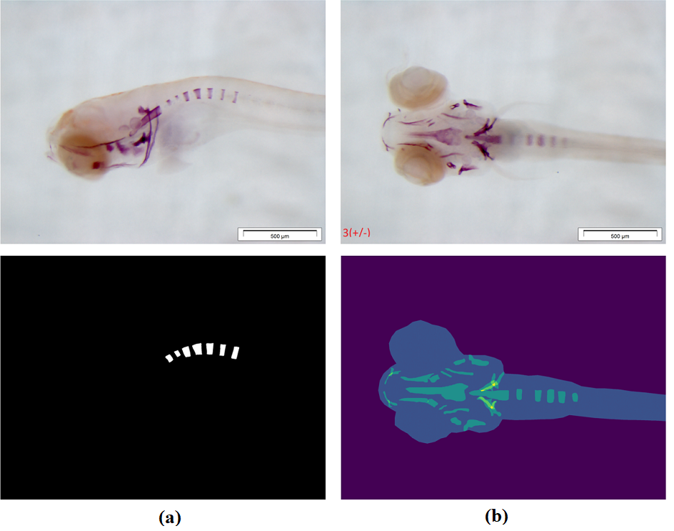

# S_Deep-Bone

**Description:**
A Deep Learning application for segmenting the developing bone strucutres of Zebrafish Larvae

**Abstract (short)**

Missing structures or gaps in imaging data, whether due to imaging limitations, staining inconsistencies, or structural irregularities from mutations can hinder accurate assessment of bone phenotypes. Deep learning techniques, specifically in image segmentation, can offer promising solutions for identifying and even reconstructing missing and occluded bone structures in zebrafish larval images. Using a deep learning model for semantic segmentation can enable precise identification and segmentation of bone regions across microscopy images, even when parts of the structure are weak, faint or occluded. In this approach, we present a deep learning-based semantic segmentation approach to uncover the missing, weak, faint and overlapping bone structures from microscopy image dataset of 9-day post-fertilization (dpf) zebrafish larvae, acquired from **Ventral View**

**_Repository Info_**
- Test Images folder contains the test images, you may use 
- Models folder contains the trained models directly used for testing
- Model architecture is defined in unet_modified.py in src folder
- Main file is run.py in src folder
- All the supporting functions are written in src/utils.py
- Custom _loss functions_ used in the models are written in src/loss_functions.py for **compiling the model**
- Code is compatible with the open-source tool Cytomine ULiège R&D version (https://uliege.cytomine.org)

  **Features**

  -Implementation of UNet based segmentation strategy for segmenting bone strucutres from the head of zebrafish larvae:
    - UNet based Multi-mask binary segmenation approach for bone strcture segmenation
    - Two types of loss functions are evaluated namely **Focal Loss** and **Bi-tempered Loss**

**Dataset:**

- Zebrafish lavae (10 dpf) as model fish species
- 113 brightfield microscopy images of zebrafish larvae in **Ventral View**

**CNN Architecture:**

- Single output layer Unet for cropiing
- Multi-output layerd UNet for segmenting 25 various bone structures

**Test Predictions**

   <em>Figure 1: test predictions</em> 
  

**_Reference_**
- Uncovering the bone structures in Zebrafish Larvae: A Deep Learning Approach in Microscopy

**Citation:**
(Coming soon)
